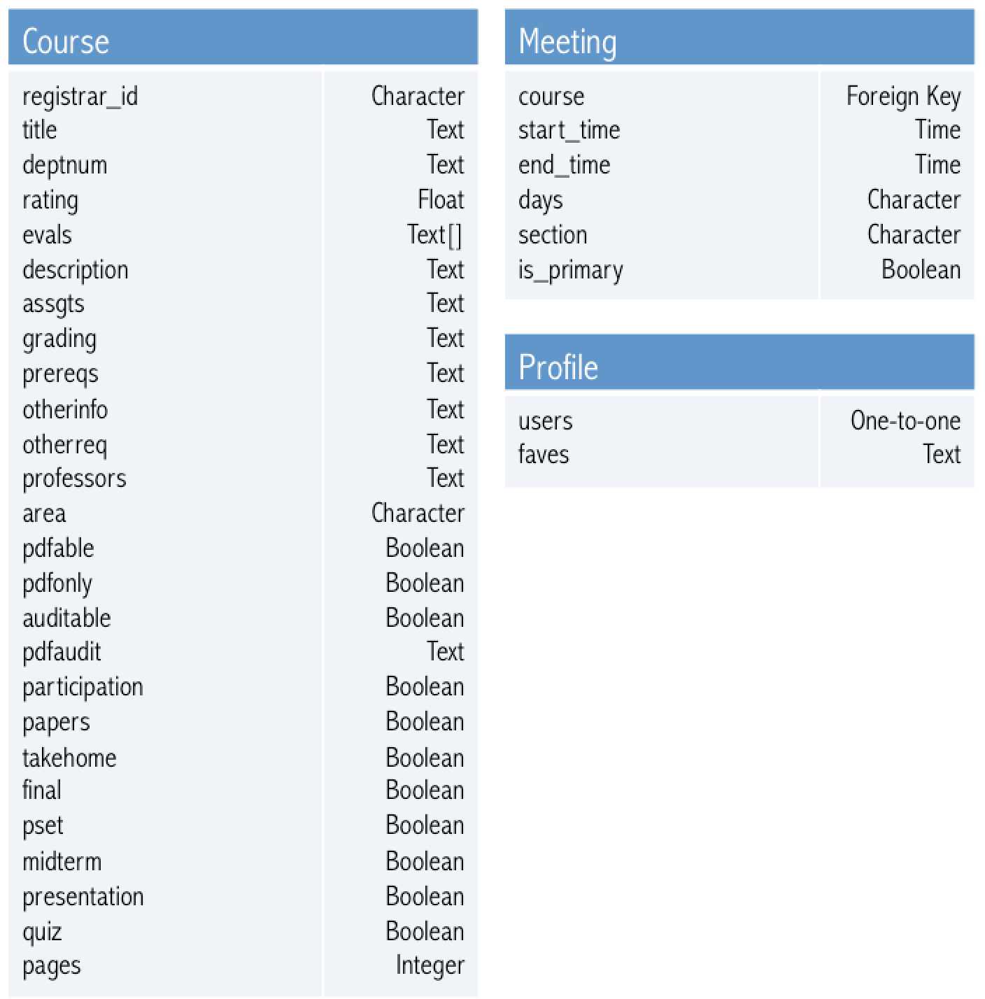

# ReCourse


## Running things
While in the parent directory run the following command to start things (localhost part necessary for CAS)
~~~~
python manage.py runserver localhost:8080
~~~~

#### Note, this only works if you have the proper .env file with all the environment variables (for things like database url, secret key, etc.)

## API Guide

### SEARCH QUERY API 
Each filter is appended to “/courses/filter” to form the query string.

|Name			       |Description|
|----------------|-----------------------------------------------------------------------------------------------------------|
|/auditable		   |Flag for returning courses that can be audited.|
|/cert_          |Return courses that count towards the specified certificate(s) <br> **Example:** /cert_&#124;Finance&#124;Arabic will return courses that count towards the Finance and Arabic certificates.|
|/conflict_      |Return courses that do not have primary section* conflicts with the specified courses. <br> **Example:** /conflict_&#124;COS 217&#124;COS 226&#124;ECO 101 will return courses that do not have time conflicts with COS 216, COS 226, and ECO 101.|
|/days_          |Return courses that have primary section* meetings on at least one of the specified day(s). <br> **Example:** /days_MW will return courses that meet on Monday, Wednesday, Monday and Wednesday. |
|/daysexact_	   |Return courses that have primary section* meetings exactly on the specified day(s). <br> **Example:** /daysexact_MW will return courses that meet on both Monday and Wednesday.|
|/depts_         |Return courses that are listed in a specified department(s). <br> **Example:** /depts_&#124;COS will return courses that are listed or cross-listed in the Computer Science department.|
|/excludearea_   |Return courses that do not fulfill the specified distribution area(s). This includes courses that do not fulfill any distribution area. <br> **Example:** /excludearea_&#124;SA&#124;HA will return courses that are not designated as an “SA” or an “HA”.|
|/includearea_   |Return courses that fulfill the specified distribution area(s). <br> **Example:** /includearea_&#124;QR&#124;STL will return courses that are designated either as a “QR” or an “STL”.|
|/excludegrade_  |Return courses that do not contain the specified category/categories in their grading criteria. <br> **Example:** /excludegrade_&#124;Paper will return courses that do not contain papers in their grading criteria. |
|/includegrade_  |Return courses that contain the specified category/categories in their grading criteria. <br> **Example:** /includegrade_&#124;Take-homeExam will return courses that contain a take-home exam in their grading criteria.|
|/frosh          |Return courses that are open to freshmen.|
|/keyword_       |Return courses that contain the specified keyword in their course description. <br> **Example:**  /keyword_theater will return courses that contain the word “theater” in the course description.|
|/lucky          |Flag for activating the “I’m Feeling Lucky” easter egg. Flag signals to return a random course from the list of courses fitting the search criteria, or no course if no courses fit the search criteria. If no search filters are applied, return a random course from the set of all courses.|
/nums_           |Return courses that contain the specified number(s) or regex pattern(s) in their course number. For regex patterns, we only accept the special wildcard character “?” in user input. <br> **Examples:** <br> /nums_&#124;100&#124;101 will return courses that contain the numbers 100 or 101 in their course listing. <br> /nums_&#124;1?? will return all 100-level courses (including courses with letter suffixes, such as CEE 102A) <br> /nums_&#124;?12 will return all courses that have a course number ending in “12”.|
|/no-prereq      |Flag for returning courses that contain no prerequisites.|
/no_grad         |Flag for returning courses that are not graduate-level courses.|
|/only_grad      |Flag for only returning courses that are graduate-level courses.|
|/pages_         |Return courses that contain at most the specified number of pages of reading. Courses that do not specify number of pages per week will not be returned. <br> **Example:** /pages_100 will return courses that contain at most 100 pages of reading per week.|
|/pdfable        |Flag for returning courses that can be taken on a PDF-basis. Includes PDF-only courses.|
|/pdfonly        |Flag for returning courses that can only be taken on a PDF-basis.|
|/profs_         |Return courses that are taught by the specified professor(s). <br> **Example:** /profs_&#124;Appel&#124;Dan Leyzberg will return courses that contain “Appel” or “Dan Leyzberg” within the names of professors associated with the course.|
|/rating_        |Return courses that have a rating that is greater than or equal to the specified rating. <br> **Example:** /rating_3.0 will return courses that have a minimum rating of 3.0|
|/starttime_     |Return courses that have a primary section* start time within the hour of the designated start time(s). <br> **Example:** /starttime_&#124;10:00 am&#124;12:00 pm will return courses that have primary sections starting within the hour of 10:00am and 12:00pm.|
|/title_         |Return courses that contain the specified string in the title. <br> **Example:** /title_Algorithm will return any course that contains the word “Algorithm” (case insensitive) within the course title.|
|/trip           |Flag for returning courses that can contain trips.|

*Primary section is designated as a section of type L, S, U and type C if there are no sections of type L, S, U.


### FAVORITES API

|Name			                     |Description|
|------------------------------|---------------------------------------------------------------------------------------------|
|/courses/get_faves            |Sends a “GET” request to the database and returns the user’s stored favorites as a JSON object.|
|/courses/add_faves/XXXXXX     |Sends a “POST” request to the database, where the value of “XXXXXX” is the 6-digit course ID of the course. <br> **Example:** /courses/add_faves/002065 adds the course COS 333	to a user’s favorites.|
|/courses/del_faves/XXXXXX     |Sends a “DELETE” request to the database, where the value of “XXXXXX” is the 6-digit course ID of the course. <br> **Example:** /courses/del_faves/007999 deletes the course ORF 309 from a user’s favorites.|

## Database Table Structures



## Virtual Environment Setup
Especially useful if you try to run things and something along the lines of missing dependencies is mentioned

I'm assuming pip is your package manager, if not, replacing pip with the appropriate command should still work (e.g., I use conda)

1. Install virtualenv

````$ pip install virtualenv````

2. Next use virtualenv to create your environment folder, where all your installed python modules will live.

````$ virtualenv env```` OR ALTERNATIVELY ````$ virtualenv venv````

3. Next you need to go activate your virtualenv

````$ source env/bin/activate````

4. Next you need to install the requirements for the project in your env folder

````(env) $ pip install -r requirements.txt````

5. If you ever need to install something new, add it to requirements.txt, in the following form:

````module-name >= x.x.x````
